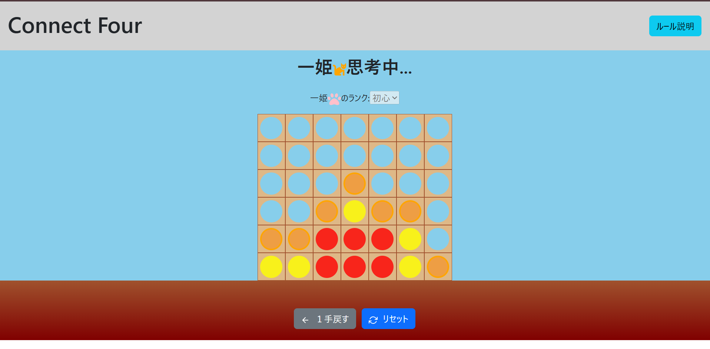

# Connect Four

**Date:** 2025/9/9

## 実装概要
AI対戦ができるコネクトフォーです。AIは4種類の強さから選択できます。

## 使用した技術
- React
- Redux
- Bootstrap
- Minimax法やMCTSといった探索アルゴリズム

## 機能説明
それぞれのAIのアルゴリズムは以下の通りです。

- **雀士（弱い）**：自分と相手の1手先の勝敗を判断し、必勝の場所や置かなければ必負の場所に置く。そのような場所がなければ、ランダムに置く。
- **雀豪（普通）**：3手先（相手の手を含めると6手先）までの状況をMinimax法で評価関数を用いて評価する。
- **雀聖（強い）**：MCTSで15000回シミュレーションする。
- **魂天（とても強い）**：thunderサーチ（盤面の評価関数を利用したMCTS）で15000回シミュレーションする。

## AI同士の対戦成績

| 勝-負-分 | 雀士 | 雀豪 | 雀聖 | 魂天 | 成績 |
| ---- | ---- | ---- | ---- | ---- | ----|
| 雀士 |  | 0-50-0 | 0-50-0 | 2-48-0 | 2-148-0 |
| 雀豪 | 50-0-0 |  | 17-30-3 | 25-25-0 | 92-55-3 |
| 雀聖 | 50-0-0 | 30-17-3 |  | 18-30-2 | 98-47-5 |
| 魂天 | 48-2-0 | 25-25-0 | 30-18-2 |  | 103-45-2 |

## ファイル構成
- `App.js`：メインコンポーネント
- `Board.js`：盤面の操作
- `Header.js`：タイトル・ルールモーダルの表示
- `config.js`：列、行の定数
- `store.js`：Redux部分
- `utils/`：AIアルゴリズム・勝敗判定
- `testAi.js`：node.jsでAI同士を対戦させるプログラム